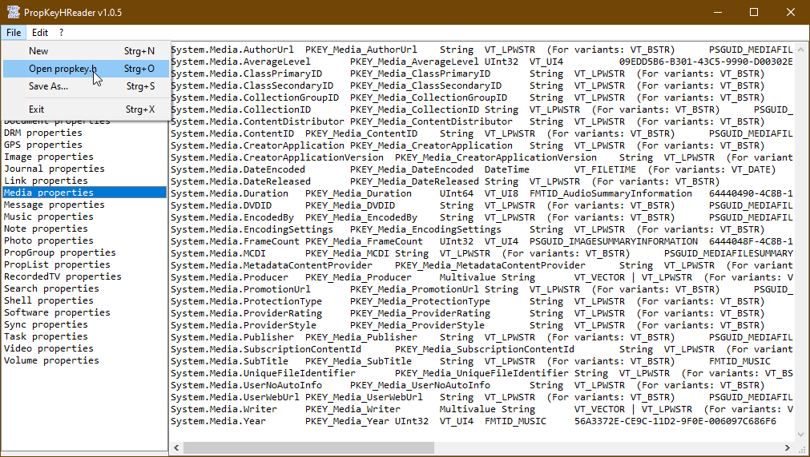

# COM_PropKeyH  
## reading the file propkey.h  

 

Project started in july 2022.  
This project is for reading and parsing the file propkey.h. This file contains all propertykeys for reading file properties of different file types by implementing the IPropertyStore interface (->will come soon).  
This is not for generally reading/parsing of c-style header-files. The reading mechanism is held simple because the propkey.h has a simple format.  
After reading the propkey.h the data can be transfered to a file with 'tab-separated-values'. In this format the data is very easy to read or even copy/paste to a excel-sheet.  
For this vb-project you need the following files from other projects not contained in this package:  
  
Modules:  
 * MErr:    Err_CorrectErrorHandling\Modules\MErr.bas  
 * MPtr:    Ptr_Pointers\Modules\MPtr.bas  
 * MShell:  IO_PathFileName\Modules\MShell.bas  
 * MString: Sys_Strings\Modules\MString.bas  
  
Classes:  
 * List:           List_GenericNLinq\Classes\List.cls  
 * OpenFileDialog: Win_Dialogs\Classes\OpenFileDialog.cls  
 * PathFileName:   IO_PathFileName\Classes\PathFileName.cls  
 * SaveFileDialog: Win_Dialogs\Classes\SaveFileDialog.cls  
 * StringBuilder:  Sys_StringBuilder\Classes\StringBuilder.cls  

